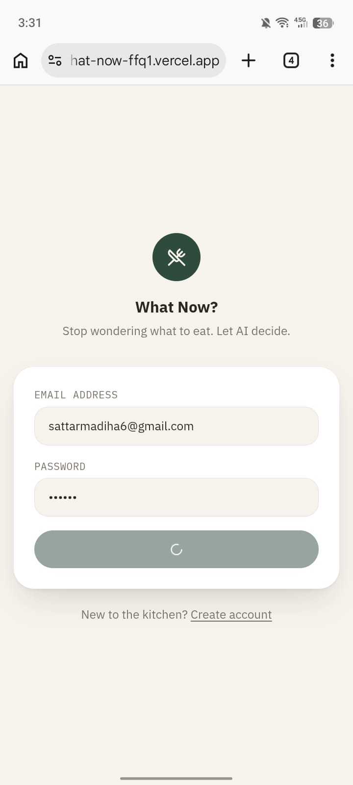
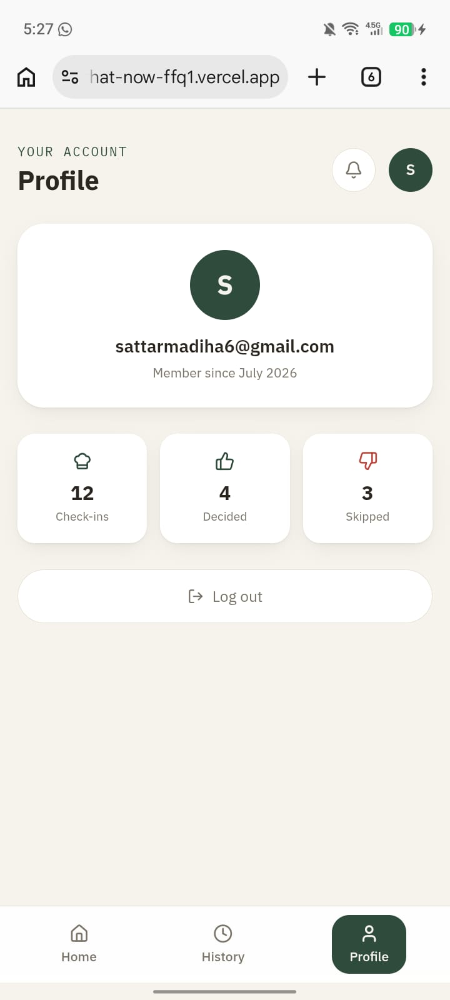

# What Now? — a meal picker that fights food decision fatigue

## a. What it does, and the problem it solves

**What Now?** is a web app that answers one question — *"what should I eat?"* — the way a
friend who cooks would: it gives you **one confident dish**, not a list to scroll through.

Most recipe apps solve the wrong problem. They assume the hard part is *finding* recipes,
so they hand you ten options. But if you're tired, hungry, and low on energy, ten options
is ten more decisions you don't have the bandwidth for — that's **decision fatigue**, the
same mental exhaustion that makes small daily choices (what to wear, what to eat, what to
watch) feel disproportionately draining after a long day.

**Who it's for**: students, people living alone, and anyone who cooks regularly and is
tired of the "what do you want to eat" back-and-forth — with themselves or a housemate.

**How it actually helps**: you type what you have in the fridge/pantry and how much energy
you have to cook. The app gives you exactly **one** dish, with one short reason and a real
recipe. If you don't want it, you say "not feeling it" and it picks again — but it
remembers what you rejected, both in that session and across past sessions, so it stops
suggesting things you keep saying no to. Over time, a History page shows your patterns
(what you actually ended up eating, and what you keep rejecting), turning the app into a
running log of your own food decisions rather than a static database of recipes.

## b. Live URL

🔗 https://what-now-ffq1.vercel.app/login

## c. Features

- Email/password sign-up and login (Supabase Auth), so your history is saved to your
  account and available from any device
- Check-in form: free-text ingredients, an energy-level picker (Low / Medium / High), and
  an optional craving
- AI generates **exactly one** dish recommendation — dish name, one-line reason, estimated
  time, difficulty, and a full numbered recipe — never a list of options
- **Pantry checklist**: the ingredients you entered are shown as tickable checkboxes on the
  recommendation card, so you can check them off as you cook
- **"Not feeling it"** — regenerates a new suggestion, permanently excluding anything
  already rejected in that session
- **"I'll make this"** — marks a dish as accepted/decided, stamped visually on the card
- Rejection memory across sessions — the AI is told what you've rejected recently and
  quietly steers away from those patterns
- History page — every past check-in, grouped by session, with a "Foods you usually skip"
  pattern summary and a one-click **CSV export** of your full history
- Profile page — account info and quick stats (total check-ins, decided, skipped)
- Row-level security in the database — every user can only ever see their own check-ins

## d. The AI feature

**What it does**: takes your ingredients, energy level, optional craving, and your
rejection history, and returns a single structured recommendation (dish name, one-sentence
reason, numbered recipe, estimated time, difficulty) as JSON, which the app then renders as
a recipe card.

**Model used**: Llama 3.3 70B via the **Groq API** (OpenAI-compatible chat completions
endpoint), called server-side from a Next.js API route so the API key never reaches the
browser.

**The system prompt** (the actual instructions sent to the model, in
`src/lib/ai/recommend.js`):

```
You are the decision-making engine inside "What Now?", an app built for one purpose: to fight food decision fatigue.

Your single job is to remove choice, not add it. The person opening this app is tired, hungry, and does not want a menu of options - they want one confident answer, the way a friend who cooks would just tell them what to make.

RULES YOU MUST FOLLOW:
1. Recommend EXACTLY ONE dish. Never present alternatives, never say "you could also try", never hedge with "or".
2. The dish must be realistically makeable with the ingredients the person listed (plus reasonable pantry basics like salt, oil, water, pepper - assume those are always available unless the person says otherwise).
3. Match the dish's effort to the stated energy level:
   - "low" energy = under 15 minutes, minimal steps, minimal cleanup
   - "medium" energy = a real cooked meal, 15-35 minutes, normal effort
   - "high" energy = the person WANTS to cook something involved; you may suggest something with more steps or technique
4. If the person lists a craving, respect it, but the energy level always wins if they conflict (e.g. craving something elaborate but low energy = simplify it, don't ignore the craving entirely).
5. You will sometimes be given a list of dishes this same person has already rejected in this session, or rejected recently in past sessions. NEVER repeat a rejected dish in the same session. Use past rejection patterns as a soft signal (e.g. if they consistently reject soups, lean away from soups) but do not mention this reasoning to the user explicitly - just quietly make a better pick.
6. Your "reason" must be ONE short sentence (max ~20 words), written like a friend explaining their pick in passing, not a nutritionist justifying a decision. Reference what they told you (ingredients/energy/craving) concretely.
7. Your "recipe" must be genuinely usable: 3-6 short numbered steps, plain language, no filler, assuming a home kitchen.
8. Estimate "time_minutes" as a realistic integer for the whole dish (prep + cook), consistent with the energy level.
9. Set "difficulty" to exactly one of "Easy", "Medium", or "Hard", consistent with the energy level and number of steps.

Respond ONLY with valid JSON, no markdown fences, no preamble, in exactly this shape:
{
  "dish_name": "string, the name of the dish",
  "reason": "string, one short sentence",
  "recipe": "string, numbered steps separated by newlines, e.g. 1. ...\n2. ...\n3. ...",
  "time_minutes": integer,
  "difficulty": "Easy" | "Medium" | "Hard"
}
```

The rejection history (this session + recent past sessions) is passed in the user message
alongside the ingredients/energy/craving on every call, so the "quietly learns your
patterns" behaviour is driven entirely by what's stored in the database, not by any memory
built into the model itself.

## e. Tools, services, and models used

- **Next.js** (App Router, JavaScript) — frontend and backend in one framework
- **Supabase** — Postgres database + email/password authentication, with row-level
  security policies restricting each user to their own data
- **Groq API** (`llama-3.3-70b-versatile`) — the AI recommendation feature, free tier, no
  card required
- **Tailwind CSS v4** — styling
- **lucide-react** — icons
- **Vercel** — hosting/deployment
- **Fontsource** (IBM Plex Sans, IBM Plex Mono) — self-hosted fonts
- Built with the help of **Claude** (Anthropic) as a coding assistant

## f. Screenshots

**Add at least 3 screenshots here once your app is deployed** — for example:

1. The check-in form
2. A generated recommendation card
3. The history page


| Login Screen | Recommended Recipe |
|---------------|--------------------|
|  |  |

| Profile Screen | Recipe History |
|----------------|----------------|
|  |  |

## g. How to run this project

### Run it locally

1. **Clone the repo**
   ```bash
   git clone <your-repo-url>
   cd what-now
   npm install
   ```

2. **Set up Supabase**
   - Create a free project at [supabase.com](https://supabase.com)
   - Go to **SQL Editor** → paste the contents of `supabase/schema.sql` → run it (this
     creates the `checkins` table and its row-level security policies)
   - Go to **Project Settings → Data API** and copy your **Project URL** and
     **publishable (anon) key**

3. **Get a free Groq API key**
   - Sign up at [console.groq.com](https://console.groq.com) (no card required)
   - Go to **API Keys → Create API Key**

4. **Set environment variables**
   ```bash
   cp .env.local.example .env.local
   ```
   Fill in `.env.local` with your Supabase URL/key and your Groq API key.

5. **Run it**
   ```bash
   npm run dev
   ```
   Open [http://localhost:3000](http://localhost:3000), sign up with any email/password,
   and use the app.

### Deploy it live (Vercel)

1. Push this repo to your own **public** GitHub repository.
2. Go to [vercel.com](https://vercel.com) → **Add New Project** → import your GitHub repo.
3. In the Vercel project settings, add the same three environment variables from
   `.env.local` (`NEXT_PUBLIC_SUPABASE_URL`, `NEXT_PUBLIC_SUPABASE_ANON_KEY`,
   `GROQ_API_KEY`) under **Settings → Environment Variables**.
4. Deploy. Vercel gives you a public URL — that's your live app.

## Database schema

See `supabase/schema.sql` — one table (`checkins`) storing every suggestion shown to a
user, with a `status` of `suggested`, `accepted`, or `rejected`, grouped by a `session_id`
per decision session. Row-level security ensures a user can only read or write their own
rows. If you already ran an earlier version of the schema, run
`supabase/migration_add_time_difficulty.sql` once to add the newer `time_minutes` and
`difficulty` columns.
